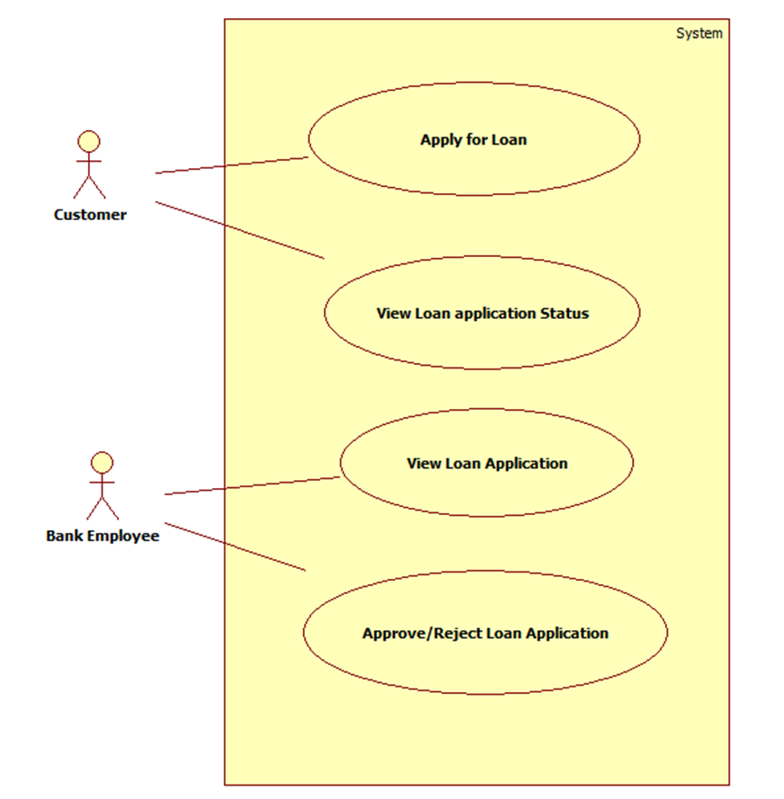

# Collateral Loans Risk Assessment

A web-app where a customer applies for a loan against a collateral. An authorized bank employee approves/rejects the loan based on the collateral. This is the Enhancement Project I made during my internship in Cognizant. Project duration is 2 weeks.

### List of Microservices

| Microservices Name         | Description                                                                                                                                                                                                                                                                     |
|----------------------------|---------------------------------------------------------------------------------------------------------------------------------------------------------------------------------------------------------------------------------------------------------------------------------|
| **Loan Management**        | Apply for Loan Approve/Reject Loan Application View Loan application status                                                                                                                                                                                             |
| **Collateral Management**  | Verify and Save the Collaterals                                                                                                                                                                                                                                                 |
| **Risk Assessment**        | Raise Risk based the Collateral value based on Market                                                                                                                                                                                                                           |
| **Collateral Loan Portal** | A Web Portal that allows a Back Office Staff to login and allows to do the following operations: 1. Login 2. Get Loan Details based on Customer/Loan ID 3. Save Collaterals for a sanctioned loan 4. View Risk Assessment for every Collateral Loans (for bank) |

### Use Case Diagram

